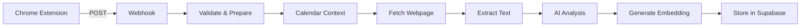

# Capture_URL_v1.0

## Executive Summary

### Business Purpose
Production-grade workflow for capturing, enriching, and storing web content with AI-powered analysis and vector embeddings. Enables intelligent content retrieval through semantic search capabilities, transforming scattered web captures into a searchable knowledge base.

### Key Business Value
- **Automated Processing**: 8-12 seconds automated processing vs manual cataloging
- **Search Efficiency**: Semantic search across all captured content
- **Context Preservation**: Automatic correlation with calendar events and location
- **Knowledge Management**: Structured storage of web research with AI-generated insights

## System Architecture

### Workflow Overview
```
Chrome Extension → Webhook → Validation → Calendar Context → Web Fetch → 
Text Extraction → AI Analysis → Embedding Generation → Supabase Storage
```

### Component Integration
- **Input**: Chrome Extension via webhook
- **Processing**: n8n workflow (10 nodes)
- **External Services**: Google Calendar, OpenAI, Supabase
- **Output**: Enriched captures in vector database

### Data Flow Diagram


## Node Specifications

### Node 1: Webhook (Entry Point)
**Type**: `n8n-nodes-base.webhook`  
**Version**: 2.1  
**webhook ID**: `19a5d8b7-edca-4284-8656-356c0c56e6bf`

#### Configuration
```json
{
  "httpMethod": "POST",
  "path": "19a5d8b7-edca-4284-8656-356c0c56e6bf",
  "responseMode": "responseNode"
}
```

#### Expected Payload
```json
{
  "url": "string (required)",
  "title": "string (optional)",
  "comment": "string (optional)",
  "captured_at": "ISO 8601 timestamp",
  "geo_location": {
    "latitude": "number",
    "longitude": "number",
    "accuracy": "number (meters)"
  }
}
```

---

### Node 2: Respond_ToWebhook
**Type**: `n8n-nodes-base.respondToWebhook`  
**Version**: 1.1

#### Configuration
```json
{
  "respondWith": "json",
  "responseBody": "{\"status\": \"received\"}"
}
```

#### Purpose
Immediate acknowledgment to Chrome extension, preventing timeout while processing continues.

---

### Node 3: Code_ValidateAndPrepare
**Type**: `n8n-nodes-base.code`  
**Version**: 2

#### Validation Rules
1. **URL Validation**
   - Must match `/^https?:\/\/.+/`
   - Required field
2. **Timestamp Validation**
   - Must be valid ISO 8601
   - Cannot be future date
3. **Internal URL Detection**
   - Patterns: `localhost`, `192.168.*`, `10.*`, `*.local`
   - Sets `is_fetchable = false` for internal URLs

#### Data Enrichment
- **capture_id**: `cap_${timestamp}_${random}`
- **url_normalized**: Removes tracking parameters (utm_*, fbclid, gclid)
- **processing_started**: Current timestamp
- **is_fetchable**: Boolean for external URL detection

#### Error Handling
- Throws descriptive errors for validation failures
- All errors logged with context

---

### Node 4: GoogleCalendar_GetEvents
**Type**: `n8n-nodes-base.googleCalendar`  
**Version**: 1.2  
**Credentials**: Google Calendar OAuth2

#### Configuration
```json
{
  "operation": "getAll",
  "calendar": "primary",
  "limit": 5,
  "options": {
    "timeMin": "{{ captured_at }}",
    "timeMax": "{{ captured_at + 1000ms }}",
    "singleEvents": true
  }
}
```

#### Failure Handling
- **Continue on Fail**: Enabled
- **Impact**: No calendar context if fails
- **Recovery**: Workflow continues without context

---

### Node 5: Code_ExtractCalendarContext
**Type**: `n8n-nodes-base.code`  
**Version**: 2

#### Processing Logic
1. Filters out working location events (`eventType: 'workingLocation'`)
2. Extracts event matching capture timestamp
3. Returns structured context:
```json
{
  "event_title": "string or null",
  "event_description": "string or null",
  "event_attendees": ["email array"],
  "calendar_fetch_status": "success|no_events|failed"
}
```

#### Special Handling
- Skips "Zuhause" (home office) events
- Handles multiple overlapping events (takes first)
- Preserves all capture data while adding context

---

### Node 6: HTTP_FetchWebpage
**Type**: `n8n-nodes-base.httpRequest`  
**Version**: 4.2

#### Configuration
```json
{
  "url": "{{ url_normalized }}",
  "options": {
    "timeout": 10000,
    "redirect": { "followRedirects": true },
    "response": { "responseFormat": "text" }
  }
}
```

#### Failure Handling
- **Continue on Fail**: Enabled
- **Timeout**: 10 seconds
- **Common Failures**:
  - Network timeouts
  - Authentication required (403/401)
  - Internal URLs (skipped)

---

### Node 7: Code_ExtractText
**Type**: `n8n-nodes-base.code`  
**Version**: 2

#### Text Extraction Strategy
1. **Metadata Extraction**
   - OpenGraph tags (og:title, og:description)
   - Meta description
   - Page title
2. **Content Extraction**
   - First 10 paragraphs
   - Minimum 50 characters per paragraph
   - Maximum 2000 characters total
3. **Content Assembly**
   - Combines metadata + paragraphs + user comment
   - Total limit: 3000 characters for AI processing

#### Output Structure
```json
{
  "fetch_status": "success|failed|skipped_internal",
  "content_for_ai": "string (max 3000 chars)",
  "metadata": {
    "og_title": "string or null",
    "og_description": "string or null",
    "meta_description": "string or null",
    "title": "string or null"
  }
}
```

---

### Node 8: OpenAI_FullAnalysis
**Type**: `@n8n/n8n-nodes-langchain.openAi`  
**Version**: 1.4  
**Model**: `gpt-4.1-mini`  
**Temperature**: 0.3

#### Prompt Engineering
The AI analyzes captured content considering:
1. User's capture intent (from comment)
2. Calendar context (meeting/event correlation)
3. Page content and metadata
4. Generates structured insights

#### Output Schema
```json
{
  "summary": "80-120 word balanced summary",
  "topic": "2-4 word category",
  "keywords": ["3-5 relevant terms"],
  "key_insight": "One sentence essential value"
}
```

#### Error Handling
- Continue on fail (prevents workflow disruption)
- Fallback to basic metadata if AI fails

---

### Node 9: HTTP_GenerateEmbedding
**Type**: `n8n-nodes-base.httpRequest`  
**Version**: 4.2  
**Model**: `text-embedding-3-small`

#### Embedding Input Construction
```javascript
[
  summary,
  keywords.join(' '),
  key_insight,
  user_comment,
  page_title
].join(' ').trim()
```

#### Vector Specifications
- **Dimensions**: 1536
- **Model**: text-embedding-3-small
- **Normalization**: L2 (unit vector)
- **Token Limit**: 8191

---

### Node 10: Supabase_StoreCapture
**Type**: `n8n-nodes-base.supabase`  
**Version**: 1  
**Operation**: Create Row  
**Table**: `captures`

#### Field Mappings (20 fields)
| Field | Source | Type |
|-------|--------|------|
| capture_id | Code_ValidateAndPrepare | string |
| url | Code_ValidateAndPrepare | string |
| url_normalized | Code_ValidateAndPrepare | string |
| page_title | Code_ValidateAndPrepare | string |
| user_comment | Code_ValidateAndPrepare | string |
| captured_at | Code_ValidateAndPrepare | timestamp |
| captured_date | Derived from captured_at | date |
| summary | OpenAI_FullAnalysis | text |
| keywords | OpenAI_FullAnalysis | jsonb |
| key_insight | OpenAI_FullAnalysis | text |
| topic | OpenAI_FullAnalysis | string |
| event_title | Code_ExtractCalendarContext | string |
| event_attendees | Code_ExtractCalendarContext | jsonb |
| geo_latitude | Code_ValidateAndPrepare | float |
| geo_longitude | Code_ValidateAndPrepare | float |
| is_internal | Code_ValidateAndPrepare | boolean |
| metadata | Code_ExtractText | jsonb |
| embedding | HTTP_GenerateEmbedding | vector(1536) |
| workflow_version | Static | string |
| fetch_status | Code_ExtractText | string |

## Monitoring Strategy

### Key Metrics to Track
- **Workflow Success Rate**: Monitor execution failures
- **Processing Time**: Track end-to-end latency
- **API Errors**: Track failures by service
- **Storage Growth**: Monitor database size

### Monitoring Implementation
Access n8n execution history at:
- https://willertai.app.n8n.cloud/workflow/ybqL6Lybsmegr8xk/executions

## Operational Runbook

### Deployment Procedure
1. **Export workflow** from development
2. **Import to production** n8n instance
3. **Update webhook URL** if needed
4. **Test with single capture**
5. **Activate workflow**

### Troubleshooting Guide

#### Issue: Missing Calendar Context
**Symptoms**: event_title always null  
**Diagnosis**:
1. Check Google Calendar credentials
2. Verify OAuth token validity
3. Review calendar permissions

**Resolution**:
- Refresh OAuth token in n8n credentials
- Check calendar sharing settings
- Verify timezone handling

#### Issue: Failed Web Fetch
**Symptoms**: No content extracted  
**Diagnosis**:
1. Check if URL is accessible
2. Review fetch_status field
3. Check for authentication requirements

**Resolution**:
- Manual verification of URL
- Check for paywall/login requirements
- Review internal URL patterns

#### Issue: No AI Summary
**Symptoms**: Summary field is null  
**Diagnosis**:
1. Check OpenAI API key validity
2. Review API quota/limits
3. Check input content quality

**Resolution**:
- Verify API key in n8n credentials
- Check OpenAI dashboard for errors
- Ensure content_for_ai has data

## Security Considerations

### Data Privacy
- **PII Handling**: User comments may contain PII
- **Location Data**: Stored with user consent only
- **Encryption**: TLS in transit, encrypted at rest
- **Access Control**: Supabase row-level security

### API Security
- **Webhook**: Obscured URL as authentication
- **OpenAI**: API key stored in n8n credentials
- **Google**: OAuth2 with minimal scopes
- **Supabase**: Anonymous key with RLS policies

## Configuration Management

### Environment Settings
```bash
# Webhook Configuration
WEBHOOK_PATH=19a5d8b7-edca-4284-8656-356c0c56e6bf
WEBHOOK_URL=https://willertai.app.n8n.cloud/webhook/19a5d8b7-edca-4284-8656-356c0c56e6bf

# Model Configuration
EMBEDDING_MODEL=text-embedding-3-small
AI_MODEL=gpt-4.1-mini
AI_TEMPERATURE=0.3

# Processing Limits
MAX_CONTENT_LENGTH=3000
FETCH_TIMEOUT=10000
```

### Version Control
- **Workflow Version**: 1.0
- **Workflow ID**: ybqL6Lybsmegr8xk
- **Last Updated**: January 2025
- **Export File**: [Capture_URL_v01.json](./Capture_URL_v01.json)

## Integration Points

### Upstream Dependencies
- **Chrome Extension**: [Documentation](../../../Extensions/Chrome/)
- **Webhook Endpoint**: https://willertai.app.n8n.cloud/webhook/19a5d8b7-edca-4284-8656-356c0c56e6bf

### Downstream Consumers
- **RAG Search Workflow**: [Documentation](../../../Retrieval/RAG_Search/)
- **Database**: Supabase captures table

### External Services
| Service | Purpose | Configuration |
|---------|---------|---------------|
| OpenAI | AI Analysis & Embeddings | API Key in n8n |
| Google Calendar | Event context | OAuth2 in n8n |
| Supabase | Data storage | Project URL & Anon Key |

## Cost Analysis

### Estimated Per-Capture Costs
| Component | Unit Cost |
|-----------|-----------|
| OpenAI GPT-4 mini | ~$0.001 |
| OpenAI Embeddings | ~$0.00002 |
| Google Calendar | Free (within quota) |
| Supabase Storage | Minimal |
| n8n Execution | Included in plan |

### Monthly Projections
- 1,000 captures: ~$1.02
- 10,000 captures: ~$10.20
- 100,000 captures: ~$102.00

## Appendix

### Workflow Export
- **File**: [Capture_URL_v01.json](./Capture_URL_v01.json)
- **Size**: 18.8 KB
- **Nodes**: 10
- **Connections**: 9

### Related Documentation
- [Database Schema](../../../../Shared_Components/Database_Schema/)
- [API Documentation](../../../../Shared_Components/API_Documentation/)
- [Chrome Extension](../../../Extensions/Chrome/)

### Change History
| Version | Date | Changes | Author |
|---------|------|---------|--------|
| 1.0 | 2025-01-09 | Initial production release | System |
| 0.9 | 2025-01-08 | Added geolocation support | Development |
| 0.8 | 2025-01-07 | Implemented vector embeddings | Development |

---

*Documentation for Capture_URL_v1.0 Workflow*  
*Last Updated: January 9, 2025*
